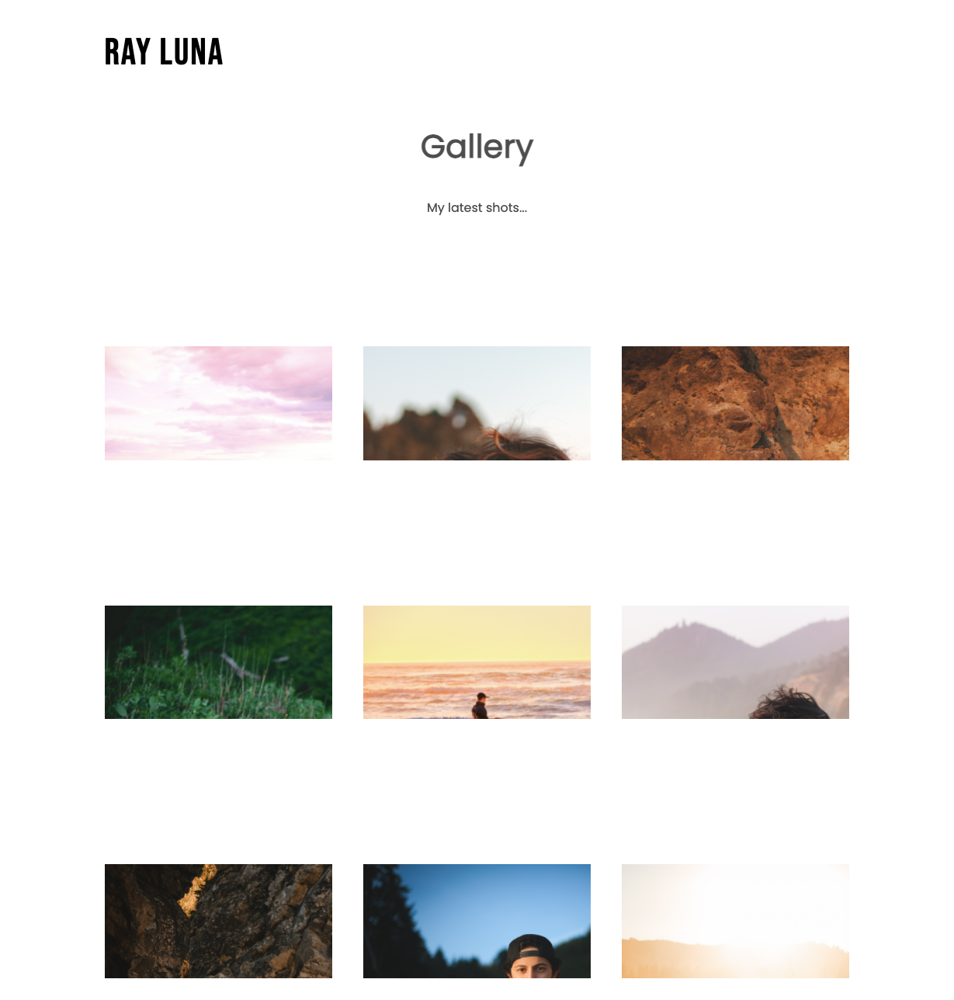

# Image Gallery

## Description

Image gallery app for my personal photography portfolio. This version is the MVP displaying a grid of images. The use can click each image to display a modal for full-size viewing.

🚧 Currently in development.

[Launch 🚀](http://www.raylunaphoto.com)

## Table of Contents

- [Image](#image)
- [Technologies](#technologies)
- [Known-Bugs](#known-bugs)
- [Next-Steps](#next-steps)
- [License](#license)
- [Contact](#contact)
- [Links](#links)

## Image

## Technologies

- Javascript
- React.js
- Node.js
- CSS
- HTML
- Firebase

## Known-Bugs

- Grid should display images in a centered format.
- CSS styling issues ongoing.

## Next-Steps

- Navigation
- Contact section
- About section
- Image download
- Authentication

## License

This project is licensed under the [MIT](https://opensource.org/licenses/MIT) license.

## Contact

Author: Ray Luna

If you have any questions about the repo, open an issue or contact me directly at:

- E-Mail: leon.luna.ray@gmail.com
- GitHub: [leon-luna-ray](https://github.com/leon-luna-ray)

## Links

- [Deployed Project](http://www.raylunaphoto.com)

- [Project Repository](https://github.com/leon-luna-ray/image-gallery)
