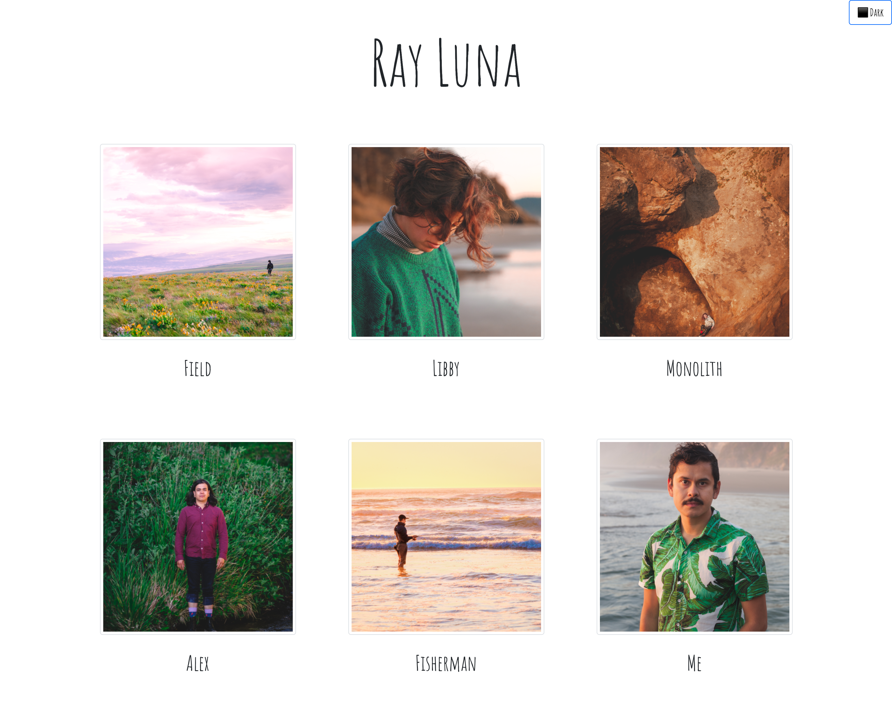

# Image Gallery 🌄🌃

## Description

This is the repository for my photography portfolio.
Current intermittent issues with gh pages deployment on custom domain.

[🚀 Launch](https://leon-luna-ray.github.io/image-gallery/)

## Table of Contents

- [Image](#image)
- [Technologies](#technologies)
- [Known-Bugs](#known-bugs)
- [Next-Steps](#next-steps)
- [License](#license)
- [Contact](#contact)
- [Links](#links)

## Image

## Technologies

- HTML
- CSS
- Javascript
- React.js
- Bootstrap
- Google Fonts

## Known-Bugs

- Problems with deployment still ongoing

## Next-Steps

- Preview Modals
- Make each image its own story with multiple images on click
- Download full resolution
- Private sharing with full set download capability

## License

This project is licensed under the [MIT](https://opensource.org/licenses/MIT) license.

## Contact

Author: Ray Luna

If you have any questions about the repo, open an issue or contact me directly at:

- E-Mail: leon.luna.ray@gmail.com
- GitHub: [leon-luna-ray](https://github.com/leon-luna-ray)

## Links

- [Deployed Project](https://leon-luna-ray.github.io/image-gallery/)

- [Project Repository](https://github.com/leon-luna-ray/image-gallery)
